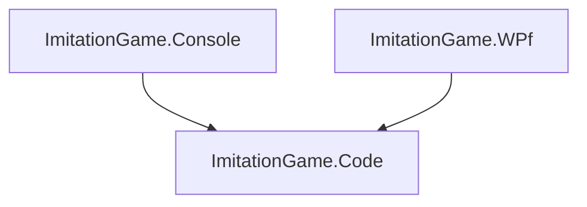

# imitation_game
Learning how encryption and decryption works

# Architecture
This application contains of 3 projects.



1. _ImitationGame.Core_: Core application with the encyption (encrytp)
2. _ImitationGame.Console_: Console application, where you can test your core encryption library.
3. _ImitationGame.Wpf_: Graphical design build in WPF, without bindings. 

# ImitationGame.Core
Contains the engine and the library with Encryptions.
How to implement a new encryption/decryption algoritme. You need the implements the _IAlgoritme_ interface.
That is very easy.

```csharp

public class MyAlgoritme : IAlgoritme
{
	public string Encrypt(string message, int key)
	{
	}

	public string Decrypt(string message, int key)
	{
	}

}
```

With the semicolon (:) and the name you add a interface to your class.
This will make sure that your class implements the methods of you interface.

# ImitationGame.Console
For the console you need to set the algoritme.
E.g.
```csharp
var machine = new Enigma();
machine.SetAlgoritme(new MyAlgoritme()); 
machine.Encrypt(message, 0); 
```

The first argument of the application is the file with the text that needs to be decrypted of encrypted.
You _Encrypt_ method is for encryption and the _Decrypt_ method is for decryption.

# ImitationGame.Wpf
The Wpf application scans with reflection the imitationGame.Core library for implementation of the _IAlgoritme_ interface.

# Possible assignment:
- Create algoritme with the interface _IAlgoritme_.
- Look at the code of the UI and make it faster.


